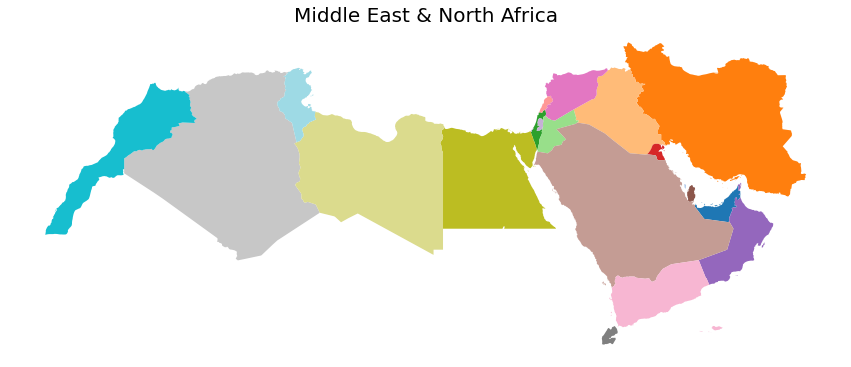

# MENA GeoJSON
composing a database of Middle East & North Africa (MENA) countries and their regions/states/provinces boundries in GeoJSON.

## MENA Countries - Project Status

|#| Country       | Country Boundry| Regions Bounries  |
|--|:----------: |:---------: | :---:|
|1| Algeria               |:heavy_check_mark:|:heavy_check_mark:|
|2| Bahrain               |:heavy_check_mark:|:heavy_check_mark:|
|3| Djibouti              |:heavy_check_mark:|:heavy_check_mark:|
|4| Egypt                 |:heavy_check_mark:|  |
|5| Iran                  |:heavy_check_mark:|:heavy_check_mark:|
|6| Iraq                  |:heavy_check_mark:|:heavy_check_mark:|
|7| Jordan                |:heavy_check_mark:|:heavy_check_mark:|
|8| Kuwait                |:heavy_check_mark:|  |
|9| Lebanon               |:heavy_check_mark:|:heavy_check_mark:|
|10| Libya                |:heavy_check_mark:|:heavy_check_mark:|
|11| Morocco              | |:heavy_check_mark:|
|12| Oman                 |:heavy_check_mark:|:heavy_check_mark:|
|13| Qatar                |:heavy_check_mark:|:heavy_check_mark:|
|14| Saudi Arabia         |:heavy_check_mark:|:heavy_check_mark:|
|15| Syria                |:heavy_check_mark:|:heavy_check_mark:|
|16| Tunisia              |:heavy_check_mark:|:heavy_check_mark:|
|17| United Arab Emirates |:heavy_check_mark:|:heavy_check_mark:|
|18| Palestine            |:heavy_check_mark:|  |
|19| Yemen                |:heavy_check_mark:|:heavy_check_mark:|

## Project Structure
- `MENA Counries` directory: contains a directory per countries.
- countries directories: each country directory contains
  - 2 `geojson` files, one for the country boundries, and the other for the country regions bounries.
  - 2 `png` images visualizing the goejson data using `geopandas`

## To Do
- add **accurate** geojson data of the regions of each country either by
   - pulling it from open source datasets and reference them
   - or manually generate the data using tools such as [geojson.io](http://www.geojson.io).
- create examples on how-to-use using libraries such as `folium` and `GeoPandas`

## Milestones
- expand project to cover all of Africa (MEA)
- expand project to cover Europe (EMEA)

## Contributions 
Please feel free to contribute

### Sources
- [OpenStreetMap](http://www.openstreetmap.org)
- [GeoJSON Maps](http://geojson-maps.ash.ms/)
